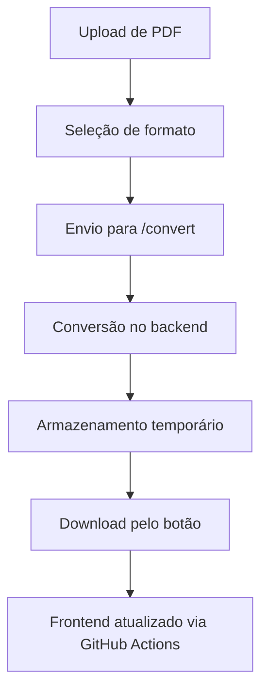

## 📄 Projeto: Conversor Inteligente de PDFs com Preservação de Links

### 🧠 Visão Geral

Desenvolver um aplicativo **em Python**, com interface web **minimalista e moderna**, que:

* **Converte arquivos PDF** em vários formatos preservando **links e estrutura de conteúdo**
* Oferece **interface de upload**, seleção de formatos e **download dos arquivos convertidos**
* Inclui **barra de progresso** e **mensagens de status**
* É **100% automatizado via GitHub Actions**
* Tem a **página web hospedada no GitHub Pages**

---

## 📦 Estrutura do Projeto

```plaintext
pdf-converter-app/
│
├── backend/
│   ├── main.py               # Aplicativo FastAPI
│   ├── converter.py          # Lógica de conversão com preservação de links
│   ├── utils.py              # Funções auxiliares
│   ├── requirements.txt      # Dependências Python
│   └── tests/                # Testes unitários
│
├── frontend/
│   ├── index.html            # Página principal (UI moderna, minimalista)
│   ├── style.css             # Estilos modernos (Tailwind ou Vanilla CSS)
│   ├── script.js             # Lógica para upload, progresso e download
│   └── assets/               # Ícones e fontes opcionais
│
├── .github/
│   └── workflows/
│       ├── backend.yml       # CI/CD para backend com GitHub Actions
│       └── frontend.yml      # Deploy da UI no GitHub Pages
│
├── output/                   # Arquivos convertidos temporários
├── README.md                 # Documentação geral
└── .gitignore
```

---

## 🚀 Funcionalidades

### 🎯 Conversão de PDF para:

* `.md` (Markdown)
* `.odt` (LibreOffice/OpenDocument)
* `.docx` (Word)
* `.txt` (texto puro)

### 🔗 Requisitos principais:

* **Preservação de links** e elementos de formatação básica
* Upload de múltiplos arquivos
* **Progresso da conversão** com barra animada
* Mensagens de status (ex: “Arquivo convertido com sucesso!”)
* Botão para **download** imediato
* Frontend e backend comunicando via API REST (FastAPI)

---

## ⚙️ Tecnologias Utilizadas

* **Python** (FastAPI, PyMuPDF, pandoc, python-docx, unoconv, pdfminer)
* **HTML + CSS (moderno)** (com TailwindCSS ou design próprio minimalista)
* **JavaScript** para interação dinâmica e fetch API
* **GitHub Actions** para CI/CD do backend e deploy do frontend
* **GitHub Pages** para hospedagem da UI

---

## 🧩 Backend (FastAPI)

* `/upload`: recebe PDF
* `/convert`: executa conversão com preservação de links
* `/download/{filename}`: retorna arquivo convertido

### Conversão

Utiliza PyMuPDF (`fitz`) para extrair texto com links, converte via `pandoc` e outras libs para manter o conteúdo fiel e os links clicáveis nos formatos suportados.

---

## 🎨 Frontend (UI)

* Interface minimalista, centralizada
* Upload de PDF
* Opções de formato (checkbox)
* Botão "Converter"
* Barra de progresso visível
* Área de status e mensagem
* Botão para download ao final

---

## ⚙️ GitHub Actions

### `backend.yml`

* Executa testes
* Constrói e publica imagem Docker ou zip de backend se necessário

### `frontend.yml`

* Publica `frontend/` via GitHub Pages
* Automatiza preview e deploy contínuo

---

## 📄 README.md (incluso no projeto)

Contém:

* Instruções para uso local
* Como contribuir
* Como rodar backend localmente
* Como subir novo build via GitHub Actions
* Como testar as conversões

---

## 🔁 Fluxo Completo (Para o Agente de IA)



---

## 🛠️ Execução passo a passo

### 1. Criar Repositório no GitHub

```bash
gh repo create pdf-converter-app --public --clone
cd pdf-converter-app
```

### 2. Instalar dependências backend (local)

```bash
cd backend
python -m venv venv
source venv/bin/activate
pip install -r requirements.txt
uvicorn main:app --reload
```

### 3. Rodar frontend local

```bash
cd frontend
# Abrir index.html em navegador
```

### 4. Configurar GitHub Actions

* Commitar arquivos e workflows
* Push no branch principal
* O GitHub Actions cuidará de tudo

### 5. Acessar site no GitHub Pages

URL: `https://<usuario>.github.io/pdf-converter-app/`

---

## 📎 Instruções para o Jules / Vibe Coding

### Prompt para execução automatizada:

```vibecoding
Gere um projeto completo com a seguinte estrutura:

- Backend em Python com FastAPI, que converte PDFs para md, odt, docx, txt mantendo links
- Frontend HTML+CSS+JS moderno com upload, opções de formato, barra de progresso, status, botão de download
- Deploy do frontend no GitHub Pages
- GitHub Actions com workflows para backend (CI) e frontend (CD)
- Estrutura modular com documentação e instruções
- Projeto completo em um repositório GitHub


